# Connecting Claude Desktop to Ignition via MCP — Full Walkthrough

Companion reference for the YouTube video — every step, file, and screenshot from the actual setup, in order. All images referenced below are in [`images/`](./images).

**Stack:** Ignition 8.3.5+ · MCP Module (Early Access) · Claude Desktop · Node.js (`mcp-remote`) · Windows 10/11

Since the Ignition Gateway runs locally, this setup stays entirely on `localhost` — no tunnel, no exposed ports.

---

## Part 1 — Install the MCP Module

1. **Request the module.** Fill out [Inductive Automation's request form](https://docs.google.com/forms/d/e/1FAIpQLSf6Hu7jAN0KsACI32iiWqe_LcpcxclSDelqqkaJ6bA4yrl5rA/viewform?usp=header), linked from the [official EA announcement thread](https://forum.inductiveautomation.com/t/mcp-module-early-access/113966). They email you the `.modl` file.
2. **Install it** like any other module: Gateway web page → **Platform → Modules → Install or Upgrade a Module** → upload the `.modl` file.

   > ⚠️ If the module isn't signed for release (common for EA builds), you may need to enable unsigned module support in `ignition.conf` first — Ignition tells you if it rejects the install for that reason.

   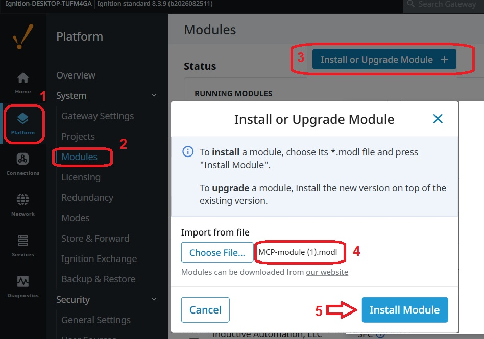
   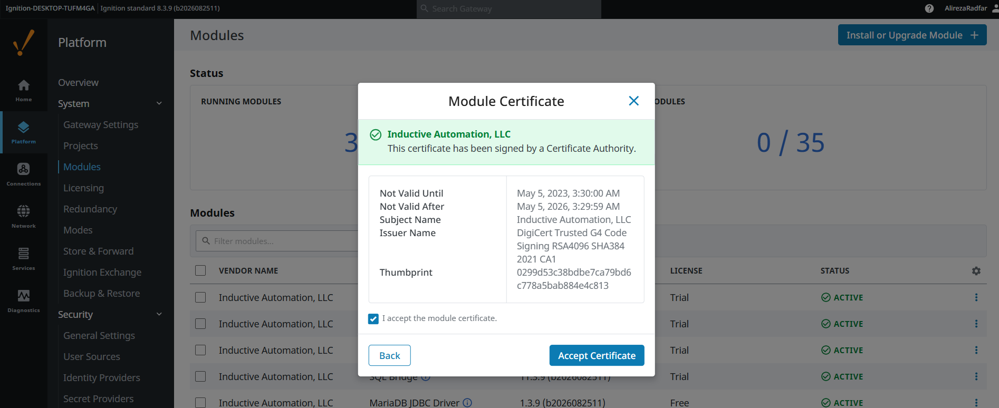

3. **Restart the Gateway** if prompted, then confirm the module shows as running under **Config → Modules**.

   

---

## Part 2 — Designer-side setup

1. **Create a project — standalone, not inheritable.** This walkthrough uses `mcp_example` throughout.

   > ⚠️ **This is the most common failure point.** An inheritable project lets the MCP server connect, but `tools/list` returns empty. Use a standalone (or child) project.

2. **Open the MCP workspace.** Once the module is installed, a new **Model Context Protocol** workspace appears in the Designer's project browser (needs Ignition 8.3.5+).

   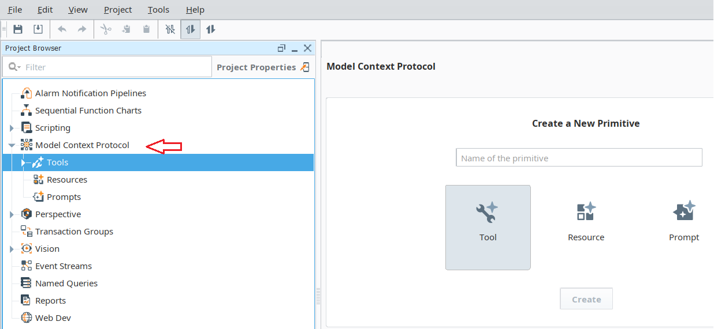

3. **Create a Tool resource.** Right-click in that workspace → **New Tool**. A Tool holds the script that runs when an MCP client (Claude Desktop) invokes it.

   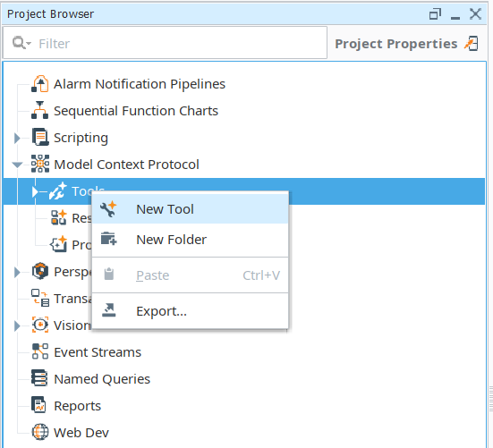

4. **Write a specific description** — this is what the connecting LLM reads to decide *when* to call the tool:

   > *"Reads live tag values for a given irrigation zone folder under the Zones UDT (e.g. Zones/Zone01). Returns current status, flow, fault state, and mode for that zone. Use this when asked about real-time zone status, to verify a zone's current state, or to compare simulated tag data across zones."*

   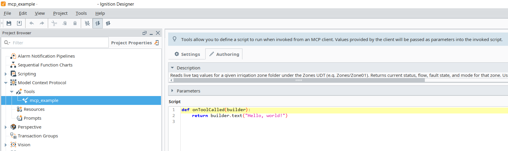

   > ⚠️ **Correction from the raw setup notes:** the screenshot above shows the actual state of the script at this stage — `onToolCalled` still has the default boilerplate body, `return builder.text("Hello, world!")`. The description text was written, but the script itself was never replaced with real tag-reading logic. That's the actual, confirmed reason the tool returned a placeholder `"Hello, world!"` later — not an unrelated environment issue as earlier guessed. **Writing the real script body (reading the Zones UDT and returning live values) is a required step still outstanding before this tool does what its description promises.**

---

## Part 3 — Gateway server-config (manual JSON)

The EA build has no UI for this yet — configured by hand on disk (a cURL/Python call to the Gateway's resources API also works).

5. **Create the server-config folder.** In the Ignition install directory:
   ```
   C:\Program Files\Inductive Automation\Ignition\data\config\resources\core\com.inductiveautomation.mcp\server-config\mcp_example\
   ```
   > ⚠️ This name becomes part of the URL — don't change it mid-process.
   > ⚠️ Under `Program Files`, which is admin-protected on Windows — edit with a text editor run as Administrator, or you'll get silent write failures.

   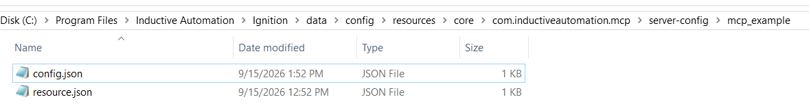

6. **Add `resource.json`** — generate your own UUID, don't reuse this one:
   ```json
   {
     "scope": "A",
     "version": 1,
     "restricted": false,
     "overridable": true,
     "files": [
       "config.json"
     ],
     "attributes": {
       "uuid": "<generate-your-own-uuid>"
     }
   }
   ```
   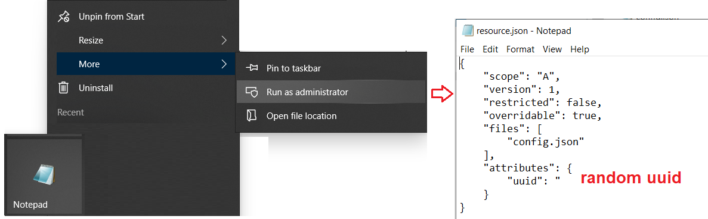

7. **Add `config.json`:**
   ```json
   {
     "title": "mcp_example",
     "version": "1.0.0",
     "permissions": {
       "type": "AllOf",
       "securityLevels": [
         {
           "children": [],
           "name": "Authenticated"
         }
       ]
     },
     "tools": {
       "project/mcp_example": "*"
     },
     "resources": {},
     "prompts": {}
   }
   ```
   The `"project/mcp_example"` key must exactly match your Designer project name.

   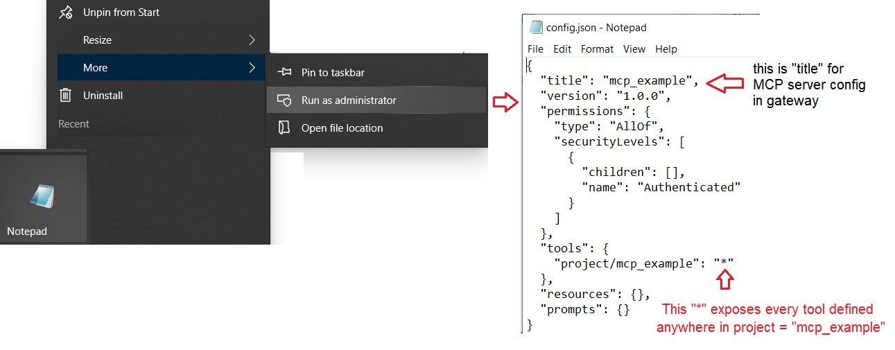

---

## Part 4 — Scan, key, and permissions

8. **Scan the config filesystem.** Gateway → **Platform Overview** → trigger a scan so the Gateway picks up the new server-config folder.

   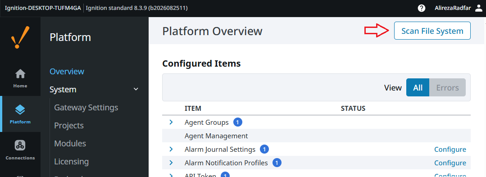

   After the scan, the new server config appears:

   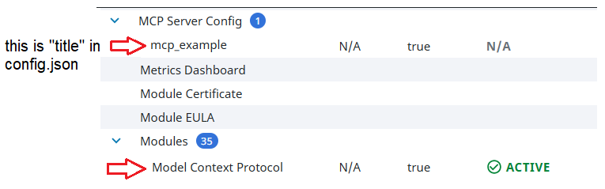

9. **Generate an API key.** Gateway → **Platform → API Keys** → create one, save it somewhere safe.

   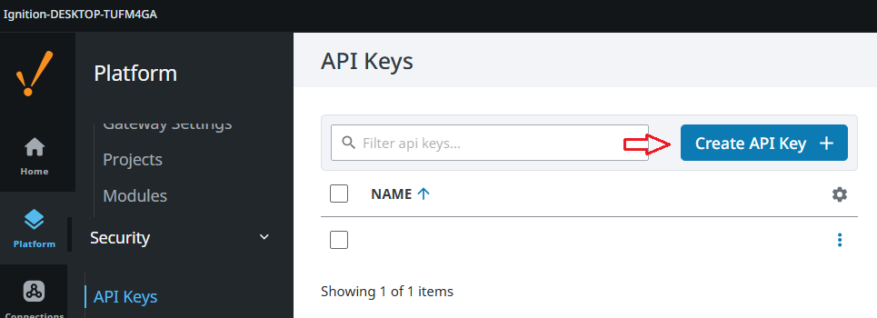

   > ⚠️ Uncheck **"Require secure connections for API Keys"** if testing over plain `http://localhost` — otherwise API key requests fail with a 403.

   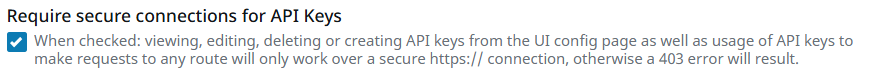

---

## Part 5 — Connect Claude Desktop

10. **Find `claude_desktop_config.json`.**
    - macOS: `~/Library/Application Support/Claude/claude_desktop_config.json`
    - Windows: `%APPDATA%\Claude\claude_desktop_config.json` — press **Win + R**, type `%APPDATA%\Claude`, Enter.

      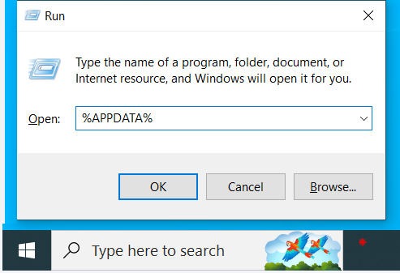

    - **Microsoft Store version:** the config lives at a different, sandboxed path instead — `C:\Users\<you>\AppData\Local\Packages\Claude_pzs8sxrjxfjjc\LocalCache\Roaming\Claude\`. If the standard path shows nothing, search your C: drive for the filename directly.

    If the file doesn't exist yet, that's normal — create it.

11. **❌ The direct HTTP format gets silently rejected.** This is the format from IA's own example docs, written for a generic MCP client:
    ```json
    {
      "servers": {
        "ignition": {
          "url": "http://localhost:8088/data/mcp/mcp_example",
          "type": "http",
          "headers": {
            "X-Ignition-API-Token": "your-token-here"
          }
        }
      }
    }
    ```
    Claude Desktop's config only parses local (stdio) server entries — this format is silently dropped, no error dialog.

12. **✅ Bridge it with `mcp-remote`** instead — a small Node package that translates the HTTP endpoint into the stdio interface Claude Desktop expects. Requires Node.js installed:
    ```json
    {
      "mcpServers": {
        "ignition": {
          "command": "npx",
          "args": [
            "-y",
            "mcp-remote",
            "http://localhost:8088/data/mcp/mcp_example",
            "--header",
            "X-Ignition-API-Token:${IGNITION_API_TOKEN}"
          ],
          "env": {
            "IGNITION_API_TOKEN": "API_KEY_HERE"
          }
        }
      }
    }
    ```
    > If the file already has an `"mcpServers"` block, add `"ignition"` as another entry inside it — don't overwrite the whole file.

    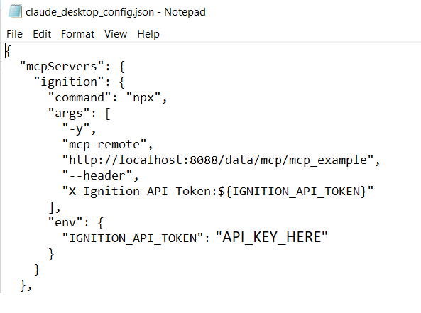

    `npx` downloads `mcp-remote` on first run — a short delay on first launch is normal, not a hang.

13. **Save, fully quit Claude Desktop from the system tray, reopen it.**

---

## Part 6 — The debugging chain

Every error below was distinct and decodable from the logs — the fix each time was reading the output carefully.

| Symptom | Root cause | Fix |
|---|---|---|
| Config silently ignored | Direct `url`/`http` entry — unsupported format | Switch to the `mcp-remote` bridge |
| `404: MCP server not found` | Gateway hadn't reloaded its internal MCP routing table after the config scan | Full Gateway **service** restart |
| `403: Forbidden` | API key's security level lacked Gateway read/write permission, and/or "Require secure connections" blocked plain HTTP | Grant permissions **and** uncheck the HTTPS requirement |

If you hit this failed state along the way:

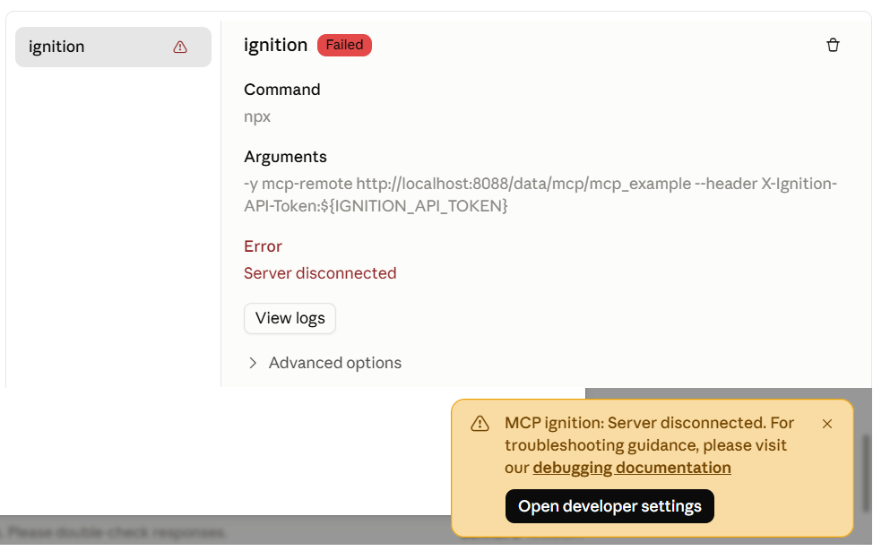

...keep going — this is what it looks like once it's actually working:

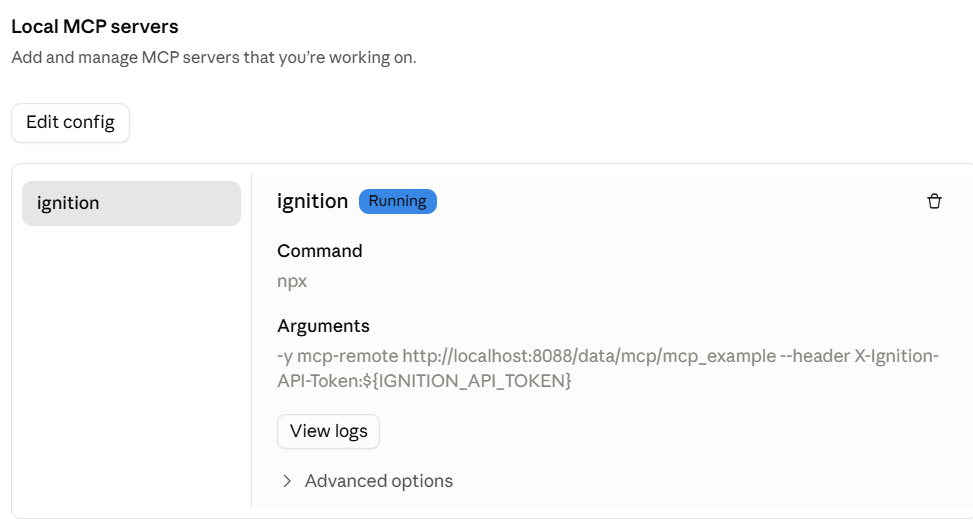

---

## Part 7 — Verify the connection (and don't stop here)

In Claude Desktop, ask directly: *"What MCP tools do you have available right now?"*

You should see your Tool listed. **But confirm it's returning real data, not the placeholder** — as Part 2 flags, the default `onToolCalled` script body needs to actually be written before this integration does anything beyond echo `"Hello, world!"`. Cross-check any live-tag claims against the Designer's tag browser directly until the script is finished.

---

*Full case study and video linked from the main repo README.*

